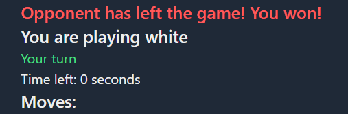

## How to run

1. **Download or clone the repository**

2. **Run Docker Compose:**
    `docker compose up -d`

3. **The frontend application will be available at [localhost:5173](http://localhost:5173).**

## Introduction
This project is an online chess platform built using React for the frontend and Node.js for the backend. It offers a robust and real-time chess playing experience, allowing players from all over the world to challenge each other.

## Game Mechanics
The game mechanics are designed to replicate the traditional chess experience with the following features:
- **Real-Time Gameplay:** Players can make moves in real-time without waiting, thanks to WebSocket connections that ensure instant communication between the client and server.
- **Move Validation:** Each move is validated on the server to prevent illegal moves and ensure game integrity.
- **Player Authentication:** Players can register and log in to keep track of their games, ratings, and history. Authentication based on jwt send in http only cookies.
- **Elo Rating System:** The game implements an Elo rating system to rank players based on their game outcomes.

## Technologies Used
- **React**
- **Node.js** 
- **MongoDB** 
- **TypeScript**
  
## Gallery

**Game lobby**

**Move time limit**

**Check...**

**Mate!**

**Win by opponent forfeiture**

**History of played games**

**Game Replay Feature**

**Players Ranking**

